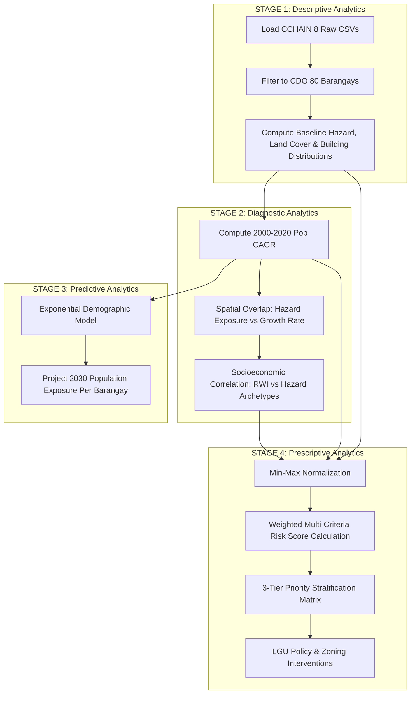
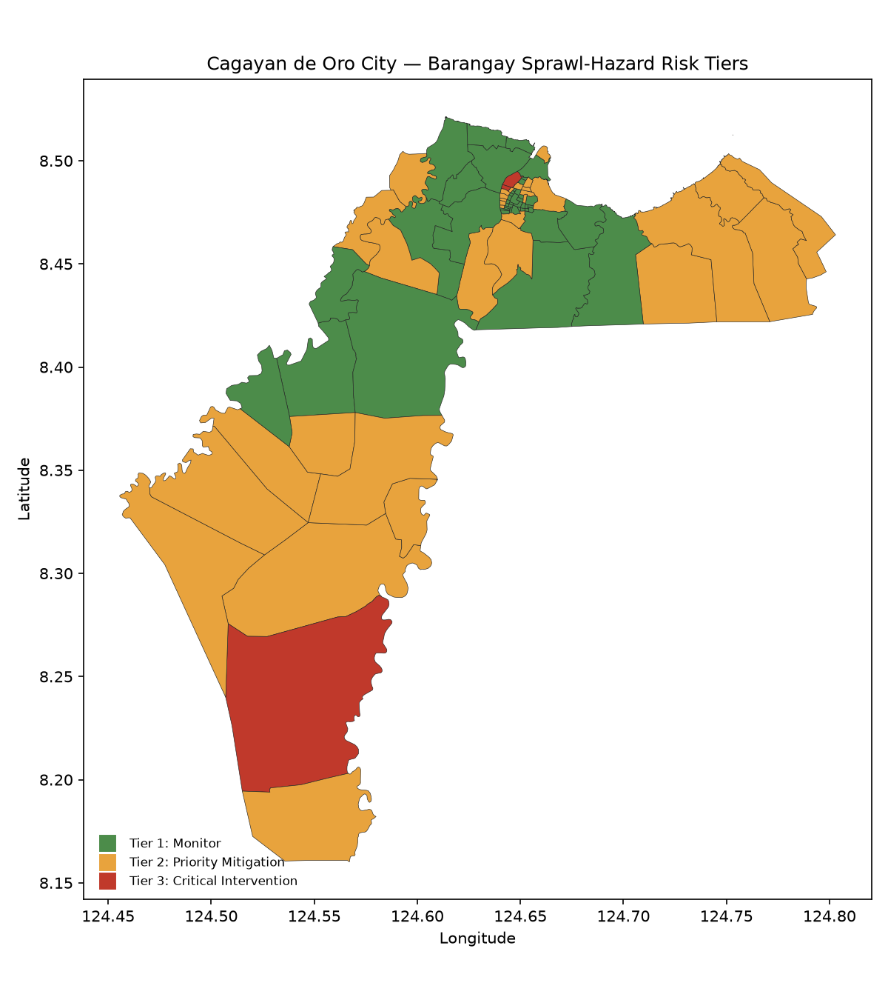
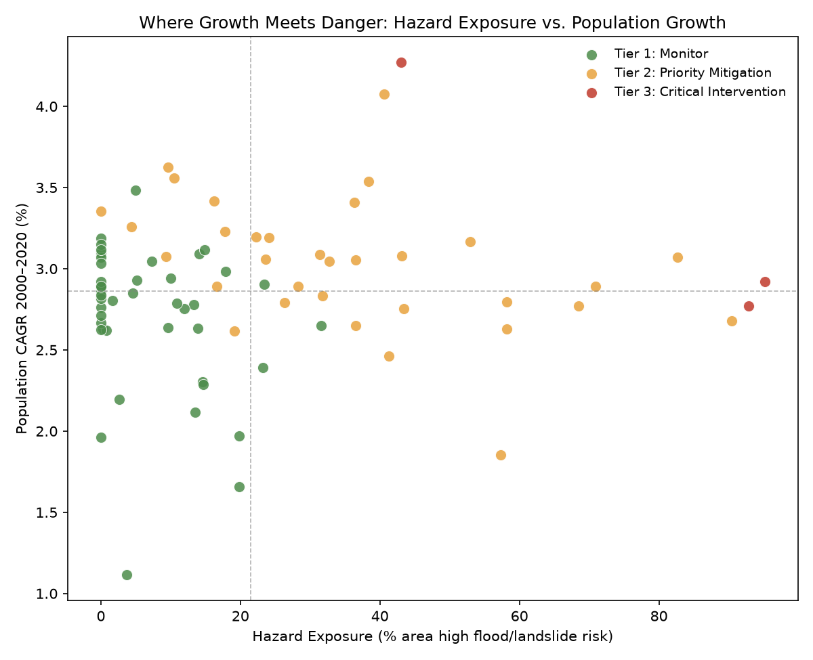
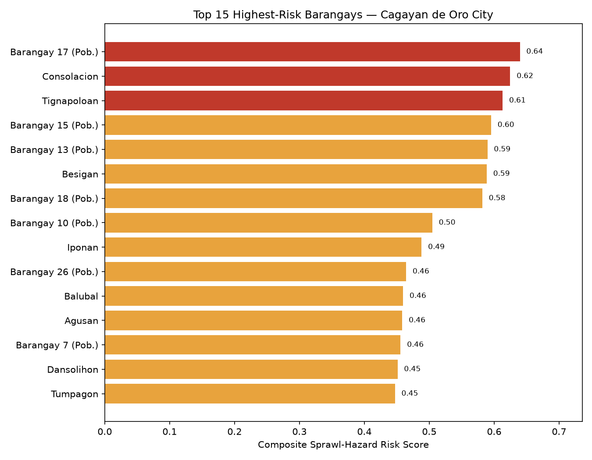
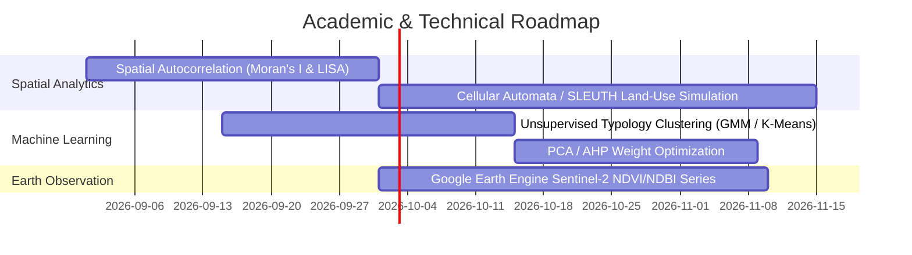

# Spatial Risk Profiling of Climate-Driven Urban Sprawl and Hazard Exposure in Cagayan de Oro City: An Integrated Multi-Criteria Analytical Framework

**Course:** Data Mining and Applications (DMA) — Laboratory Activity 1  
**Project Title:** Cagayan de Oro City Urban Sprawl & Hazard Exposure Risk Engine  
**Pilot Study Area:** Cagayan de Oro City, Northern Mindanao, Philippines (80 Administrative Barangays | PSGC: `PH104305000`)  
**Primary Data Source:** Project CCHAIN (*Climate Change, Health, and AI Network*), Kaggle Open Dataset  
**Target Stakeholders:** CDO City Planning and Development Office (CPDO), City Disaster Risk Reduction and Management Office (CDRRMO), Local Zoning Board  
**Report Version:** 1.0 (Comprehensive Academic Evaluation & Spatial Mining Report)  

---

## Executive Summary & Abstract

Rapid urbanization across the secondary metropolitan hubs of the Global South is increasingly decoupling from formal municipal spatial planning. In Cagayan de Oro City (CDO), Northern Mindanao, demographic pressures over the past two decades (2000–2020) have accelerated outward expansion into ecologically fragile floodplains and steep, geologically unstable upland slopes. This study introduces an end-to-end spatial data mining and multi-criteria risk-scoring engine across all 80 administrative barangays of Cagayan de Oro City. By integrating eight heterogeneous datasets from **Project CCHAIN**—spanning 20-year demographic time-series (WorldPop), 2D hydraulic flood and landslide models (Project NOAH), satellite-derived building footprints (Google Open Buildings), high-resolution land-cover rasters (ESA WorldCover), and micro-wealth estimates (Meta/Thinking Machines Relative Wealth Index)—we formulate an operational 4-stage analytics pipeline: **Descriptive Baseline**, **Diagnostic Spatial Overlap**, **Predictive 2030 Demographic Extrapolation**, and **Prescriptive Risk Tiering**.

Empirical results indicate that CDO’s population expanded from **419,805** in 2000 to **752,065** in 2020 (mean Compound Annual Growth Rate [CAGR] of **2.86%**), and is projected to surpass **1,008,397** residents by 2030. Spatial cross-tabulation reveals two distinct risk archetypes:
1. **Dense Riverine Delta Inundation**: Highly urbanized core barangays (*Barangay 17, Consolacion, Barangay 15, Barangay 13*) where building densities exceed 35 structures/ha and wealth is high ($RWI > 0.73$), yet over $80\text{--}95\%$ of land area is exposed to severe 100-year flood hazards.
2. **Upland Steep-Slope Informal Sprawl**: Remote, topographically rugged barangays (*Tignapoloan, Besigan, Balubal, Dansolihon*) displaying the city's highest demographic growth rates (up to **4.27% CAGR**), extensive landslide hazard exposure ($25\text{--}38\%$), and acute socioeconomic vulnerability ($RWI \le 0.32$).

Overall, **37.5%** of CDO barangays (30 of 80) exhibit $>20\%$ high-hazard land coverage, and **42.2%** of the city's 2020 population (317,160 people) resides in barangays categorized under **Tier 2 (Priority Mitigation)** or **Tier 3 (Critical Intervention)**. Spearman rank sensitivity tests ($\rho = 0.897\text{--}0.973$) confirm the stability of the prioritization index across diverse weighting regimes. This report delivers an empirical baseline, diagnostic maps, an operational decision matrix for municipal zoning, and an academic evaluation of methodological limitations and future research avenues.

---

## 1. Introduction & Operational Problem Formulation

### 1.1 Geographic & Historical Context
Cagayan de Oro City serves as the primary commercial, logistics, and administrative gateway of Northern Mindanao (Region X). Geographically, the city spans $412.80\text{ km}^2$ across 80 administrative barangays, defined by a stark topographic dualism: an alluvial coastal delta and river basin bisected by the Cagayan de Oro River and Iponan River, surrounded by rugged, deeply incised mountainous hinterlands in the south and east.

```
                  +----------------------------------------------+
                  |         Macajalar Bay (Coastal Delta)        |
                  +----------------------------------------------+
                                         |
               +-------------------------+-------------------------+
               |                                                   |
      [ Urban Riverine Core ]                             [ Rural Upland Periphery ]
  - High Building Density (30-64/ha)                 - Low Building Density (<1/ha)
  - Severe 100-Year Floodplain (70-95%)              - Severe Landslide Slopes (25-38%)
  - Higher Relative Wealth (RWI > 0.70)              - Low Relative Wealth (RWI ~0.27-0.32)
  - Moderate Population Growth (~2.7-2.9%)           - Explosive Population Growth (up to 4.27%)
  - Archetype: Brgy 17, Consolacion                  - Archetype: Tignapoloan, Besigan
```

Following catastrophic hydrometeorological events in recent history (notably Tropical Storm Sendong / Washi in December 2011), disaster management in Philippine Local Government Units (LGUs) has frequently remained **reactive and event-driven**, focusing primarily on emergency relief and post-disaster rehabilitation. However, disaster risk is fundamentally structural and kinetic: rapid demographic growth and economic pressure continuously drive informal and unguided settlement into high-hazard zones, accumulating latent risk year after year.

### 1.2 The Municipal Governance Dilemma
The CDO City Planning and Development Office (CPDO) and City Disaster Risk Reduction and Management Office (CDRRMO) face three critical structural challenges:
1. **Siloed Spatial and Socioeconomic Data**: Hazard exposure maps (Project NOAH), building registries, census records, and socioeconomic vulnerability data exist in disparate formats and administrative silos without a unified geospatial linkage.
2. **Lack of Anticipatory Spatial Prioritization**: Zoning ordinances and Comprehensive Land Use Plans (CLUP) often lack granular, data-driven prioritization indices that quantify where future population growth will collide with climate hazards.
3. **Socioeconomic Inequity in Hazard Burden**: Lower-income populations are frequently displaced toward peripheral, hazard-prone upland slopes or low-cost river easements, yet standard hazard maps treat spatial exposure without weighting socioeconomic resilience.

### 1.3 Research Objectives
This study addresses these operational and analytical gaps through four core objectives:
- **RO1 (Data Integration)**: Unify multi-modal, cross-temporal geospatial datasets from Project CCHAIN into a coherent 80-barangay analytical master schema.
- **RO2 (Spatial Diagnostics)**: Identify the empirical relationship between population growth trajectories (2000–2020), building density, land-cover composition, wealth disparity, and multi-hazard exposure.
- **RO3 (Predictive Exposure Extrapolation)**: Project demographic exposure forward to 2030 to pinpoint emerging spatial risk hotspots.
- **RO4 (Prescriptive Decision Support)**: Construct an interpretable, mathematically defensible Composite Sprawl-Hazard Risk Index and an actionable policy matrix for municipal zoning, infrastructure mitigation, and planned retreat.

---

## 2. Data Provenance & Preprocessing Pipeline

### 2.1 Primary Dataset Attribution: Project CCHAIN
All raw data utilized in this study are derived from **Project CCHAIN** (*Climate Change, Health, and AI Network*), an open-access multi-institutional research data initiative produced by **Thinking Machines Data Science**, **EpiMetrics**, **Manila Observatory**, and **PACSII**, funded by the Wellcome Trust and Lacuna Fund (Kaggle: [`thinkdatasci/project-cchain`](https://www.kaggle.com/datasets/thinkdatasci/project-cchain)).

```
+----------------------------------------------------------------------------------------------------+
|                                    PROJECT CCHAIN RAW DATA LAKES                                   |
+----------------------------------------------------------------------------------------------------+
   |                   |                    |                    |                   |
   v                   v                    v                    v                   v
[location.csv]  [project_noah.csv]  [open_bldgs.csv]   [worldcover.csv]     [worldpop.csv]  [rwi.csv]
(PSGC Codes)    (Flood/Landslide)   (Density/Footprint)(Land Cover %)       (2000-2020 Pop) (2016-2022)
   |                   |                    |                    |                   |          |
   +-------------------+--------------------+--------------------+-------------------+----------+
                                               |
                                               v  Filter: adm3_en == 'Cagayan de Oro City'
                                                  Join Key: adm4_pcode (80 Barangays)
                                               |
                                               v
                        +-----------------------------------------------+
                        |        ENGINEERED ANALYTICAL MASTER MATRIX    |
                        |      (data/processed/cdo_sprawl_hazard_ready) |
                        +-----------------------------------------------+
```

### 2.2 Table Lineage, Frequencies, and Join Architecture
The pipeline extracts and joins seven primary tables linked by the standard Philippine Standard Geographic Code at the barangay level (`adm4_pcode`), filtered by municipality (`adm3_en == "Cagayan de Oro City"`):

| Table Name | Temporal Coverage & Frequency | Spatial Resolution / Source | Key Extracted Attributes | Role in Engine |
|---|---|---|---|---|
| `location.csv` | Static Metadata | PSA PSGC Hierarchy | `adm4_pcode`, `adm4_en`, `adm3_en` | Spatial master index & lookup |
| `brgy_geography.csv` | Static Boundary (2003) | Administrative Polygons (WKT) | `geometry` | Choropleth mapping & polygon parsing |
| `project_noah_hazards.csv` | Static Snapshot (2015) | DOST-PAGASA / UP NOAH ($5\text{m}$ LiDAR) | `pct_area_flood_hazard_100yr_high`, `pct_area_landslide_hazard_high` | Multi-hazard exposure baseline |
| `google_open_buildings.csv` | Static Snapshot (2023) | Google AI Satellite Detection ($0.5\text{m}$) | `google_bldgs_count`, `google_bldgs_density`, `google_bldgs_pct_built_up_area` | Physical exposure & morphology |
| `esa_worldcover.csv` | Static Snapshot (2021) | ESA Sentinel-1/2 ($10\text{m}$) | `pct_area_builtup`, `pct_area_tree_cover`, `pct_area_cropland` | Biophysical land-use verification |
| `tm_relative_wealth_index.csv` | Annual Series (2016–2022) | Meta Data for Good / Micro-Census ML | `rwi_mean` (latest snapshot, 2016-2022 trend) | Socioeconomic vulnerability proxy |
| `worldpop_population.csv` | Annual Series (2000–2020) | WorldPop High-Res Gridded ($100\text{m}$) | `pop_count_total` | Longitudinal demographic sprawl driver |

### 2.3 Handling Temporal Heterogeneity
A key methodological consideration in this pipeline is the distinction between **kinetic time-series drivers** and **static exposure baselines**:
- `worldpop_population` ($N=21$ annual snapshots) and `tm_relative_wealth_index` ($N=7$ annual snapshots) represent dynamic longitudinal features.
- `project_noah_hazards`, `google_open_buildings`, and `esa_worldcover` represent high-resolution static baselines (`freq: S`).
Rather than imputing artificial multi-year hazard shifts, the analytical architecture models demographic growth ($2000\rightarrow2020$) as the dynamic mechanism expanding human assets into an unyielding, fixed physical hazard terrain.

---

## 3. Methodological Framework: 4-Stage Analytics



### 3.1 Stage 1: Descriptive Baseline Formulation
The baseline physical hazard exposure for barangay $i$ is formulated as the union of critical 100-year flood inundation and high-risk landslide susceptibility:
$$\text{HazardExposure}_i = \text{Flood100YrHigh}_i + \text{LandslideHigh}_i$$
where both components represent the percentage of barangay land area designated as high-risk ($[0, 100]\%$).

### 3.2 Stage 2: Diagnostic Growth Diagnostics
Demographic expansion is measured via the Compound Annual Growth Rate (CAGR) over the 20-year WorldPop longitudinal trajectory:
$$\text{CAGR}_i = \left( \frac{P_{i, 2020}}{P_{i, 2000}} \right)^{\frac{1}{20}} - 1$$
where $P_{i, t}$ represents the gridded population total of barangay $i$ at year $t$.

### 3.3 Stage 3: Predictive Population Projection (2030 Horizon)
To evaluate future asset exposure under a business-as-usual demographic trajectory, a 10-year compounding horizon ($2020 \rightarrow 2030$) is computed:
$$P_{i, 2030} = P_{i, 2020} \times (1 + \text{CAGR}_i)^{10}$$
$$\Delta P_{i, \text{growth}} = \left( \frac{P_{i, 2030} - P_{i, 2020}}{P_{i, 2020}} \right) \times 100\%$$

### 3.4 Stage 4: Prescriptive Multi-Criteria Spatial Risk Index (MCSRI)
To transform heterogeneous multi-source indicators into a unified policy index, all features are normalized using min-max scaling across the 80 barangays:
$$\widetilde{X}_i = \frac{X_i - \min(X)}{\max(X) - \min(X)}$$

The composite risk score $R_i \in [0, 1]$ is defined by:
$$R_i = w_h \cdot \widetilde{H}_i + w_g \cdot \widetilde{G}_i + w_d \cdot \widetilde{D}_i + w_w \cdot (1 - \widetilde{W}_i)$$

Where:
- $\widetilde{H}_i$: Normalized composite hazard exposure ($\text{weight } w_h = 0.40$)
- $\widetilde{G}_i$: Normalized population growth rate $\text{CAGR}_i$ ($\text{weight } w_g = 0.30$)
- $\widetilde{D}_i$: Normalized Google building density ($\text{weight } w_d = 0.15$)
- $1 - \widetilde{W}_i$: Normalized inverse relative wealth index ($\text{weight } w_w = 0.15$)

#### Operational Stratification Tiers
The continuous score $R_i$ is mapped to actionable municipal intervention tiers:
- **Tier 1: Monitor** ($R_i < 0.33$) — Baseline surveillance; standard zoning compliance.
- **Tier 2: Priority Mitigation** ($0.33 \le R_i < 0.60$) — Engineering interventions, slope stabilization, drainage upgrades, conditional permitting.
- **Tier 3: Critical Intervention** ($R_i \ge 0.60$) — Immediate building moratorium, resettlement feasibility studies, emergency floodway easements.

---

## 4. Empirical Findings & Geospatial Analysis

### 4.1 Macro-Demographic and Hazard Summary
- **Total Population Expansion**: CDO’s population increased from **419,805** (2000) to **752,065** (2020), representing a net growth of **+79.15%**. Under current trajectories, the population will reach **1,008,397** by 2030.
- **Hazard Prevalence**: **30 out of 80 barangays** (37.5%) have $>20\%$ of their land area classified as high flood or landslide hazard. 10 barangays have $>50\%$ hazard exposure.
- **Population Distribution Across Tiers (2020 Baseline)**:
  * **Tier 1 (Monitor)**: 44 barangays | 434,904 residents (57.8%)
  * **Tier 2 (Priority Mitigation)**: 33 barangays | 290,988 residents (38.7%)
  * **Tier 3 (Critical Intervention)**: 3 barangays | 26,172 residents (3.5%)
  * *Combined High-Priority Exposure (Tiers 2 & 3)*: **317,160 residents** (42.2% of CDO). By 2030, this population at risk expands to **434,279**.

### 4.2 Top 15 Ranked High-Risk Barangays

| Rank | Barangay Name (`adm4_en`) | Risk Score ($R_i$) | Risk Tier | Hazard Exposure (%) | 100-Yr Flood High (%) | Landslide High (%) | Pop CAGR (%) | Pop (2020) | Pop Proj (2030) | Relative Wealth Index (RWI) | Building Density (bldg/ha) |
|---|---|---|---|---|---|---|---|---|---|---|---|
| **1** | **Barangay 17 (Pob.)** | **0.640** | **Tier 3: Critical** | 95.14% | 95.14% | 0.00% | 2.92% | 3,720 | 4,960 | 0.769 | 37.88 |
| **2** | **Consolacion** | **0.625** | **Tier 3: Critical** | 92.90% | 92.90% | 0.00% | 2.77% | 10,333 | 13,581 | 0.733 | 36.97 |
| **3** | **Tignapoloan** | **0.613** | **Tier 3: Critical** | 43.05% | 5.04% | 38.01% | **4.27%** | 12,119 | 18,412 | **0.318** | 0.33 |
| 4 | Barangay 15 (Pob.) | 0.595 | Tier 2: Priority | 90.42% | 90.42% | 0.00% | 2.68% | 5,691 | 7,411 | 0.761 | 35.83 |
| 5 | Barangay 13 (Pob.) | 0.590 | Tier 2: Priority | 82.65% | 82.65% | 0.00% | 3.07% | 2,487 | 3,365 | 0.761 | 30.08 |
| 6 | Besigan | 0.589 | Tier 2: Priority | 40.61% | 5.93% | 34.68% | **4.07%** | 1,091 | 1,626 | **0.302** | 0.22 |
| 7 | Barangay 18 (Pob.) | 0.582 | Tier 2: Priority | 70.87% | 70.87% | 0.00% | 2.89% | 2,250 | 2,991 | 0.769 | **64.12** |
| 8 | Barangay 10 (Pob.) | 0.505 | Tier 2: Priority | 68.50% | 68.50% | 0.00% | 2.77% | 542 | 712 | 0.744 | 29.20 |
| 9 | Iponan | 0.488 | Tier 2: Priority | 52.97% | 52.97% | 0.00% | 3.17% | 30,458 | 41,598 | 0.661 | 21.72 |
| 10 | Barangay 26 (Pob.) | 0.464 | Tier 2: Priority | 58.16% | 58.16% | 0.00% | 2.63% | 2,420 | 3,135 | 0.738 | 37.44 |
| 11 | Balubal | 0.460 | Tier 2: Priority | 43.18% | 6.65% | 36.53% | 3.08% | 2,609 | 3,534 | 0.466 | 1.63 |
| 12 | Agusan | 0.458 | Tier 2: Priority | 36.34% | 12.16% | 24.18% | 3.41% | 14,856 | 20,772 | 0.525 | 9.13 |
| 13 | Barangay 7 (Pob.) | 0.456 | Tier 2: Priority | 58.21% | 58.21% | 0.00% | 2.80% | 444 | 584 | 0.744 | 24.54 |
| 14 | Dansolihon | 0.451 | Tier 2: Priority | 32.75% | 5.92% | 26.84% | 3.04% | 8,392 | 11,329 | 0.328 | 0.73 |
| 15 | Tumpagon | 0.447 | Tier 2: Priority | 41.30% | 5.28% | 36.02% | 2.46% | 1,416 | 1,805 | 0.272 | 0.28 |

---

## 5. Visualizations & Analytical Interpretations

### Figure 1: Spatial Distribution of Sprawl-Hazard Risk Tiers


#### Interpretation of Figure 1
The spatial choropleth map generated directly from the WKT boundary geometries (`brgy_geography.csv`) visualizes the macro-geographic polarization of risk across Cagayan de Oro City:
- **Red Polygons (Tier 3: Critical Intervention)** cluster in two geographically opposing zones: (1) the downstream rivermouth and central delta along the Cagayan de Oro River (Barangay 17 and Consolacion), and (2) the extreme southwestern upland frontier (Tignapoloan).
- **Orange Polygons (Tier 2: Priority Mitigation)** form a continuous spatial buffer surrounding the urban river corridor (e.g., Iponan, Barangays 10, 13, 15, 18, 26) and extend across the southern mountainous spine (Besigan, Dansolihon, Tumpagon, Balubal, Agusan).
- **Green Polygons (Tier 1: Monitor)** dominate the mid-elevation plateau and agricultural interior where slope gradients are moderate and major river channels are distant.

---

### Figure 2: Diagnostic Cross-Tabulation (Hazard Exposure vs. Population Growth)


#### Interpretation of Figure 2
The diagnostic four-quadrant scatter plot highlights the intersection of dynamic drivers (Population CAGR) and physical constraints (Hazard Exposure), demarcated by city-wide mean threshold lines ($\mu_{\text{CAGR}} = 2.86\%$, $\mu_{\text{Hazard}} = 21.48\%$):
- **Upper-Right Quadrant (High Hazard × High Growth)**: Represents the most volatile spatial risk zone. Barangay **Iponan** (pop: 30,458, CAGR: 3.17%, hazard: 52.97%) and **Agusan** (pop: 14,856, CAGR: 3.41%, hazard: 36.34%) demonstrate massive demographic accumulation directly inside severe flood-landslide corridors.
- **Top-Left Outliers (Upland High-Speed Growth)**: **Tignapoloan** (CAGR: 4.27%) and **Besigan** (CAGR: 4.07%) sit in the extreme upper echelon of demographic velocity. Despite low baseline urban density, their growth rate is 1.5x the municipal average, directly invading steep landslide slopes with negligible institutional oversight.
- **Right-Center Outliers (Urban Core Saturation)**: **Barangay 17, Consolacion, Barangay 15, and Barangay 13** cluster between $80\%\text{ and }95\%$ hazard exposure with steady 2.6–3.1% annual growth, reflecting structural entrapment in flood-prone river meanders.

---

### Figure 3: Ranked Priority Breakdown of the Top 15 Critical Barangays


#### Interpretation of Figure 3
The horizontal ranking chart demonstrates the transition across operational intervention thresholds:
- The top three barangays—**Barangay 17 (0.640)**, **Consolacion (0.625)**, and **Tignapoloan (0.613)**—exceed the $R_i \ge 0.60$ threshold, triggering **Tier 3 Critical Intervention** protocols.
- Barangays ranked 4 through 7 (**Barangay 15, Barangay 13, Besigan, Barangay 18**) form a dense secondary cluster ($0.58\text{--}0.595$), falling just below the Tier 3 boundary. This demonstrates that small shifts in localized growth or informal building expansion could push these communities into critical risk status.

---

## 6. Correlation Structure & Urban-Rural Spatial Polarization

Correlation analysis across the 80 barangays illuminates deep structural relationships within CDO’s built environment:

```
========================================================================================
CORRELATION MATRIX (Selected Key Variables)
========================================================================================
Variable                           (1)      (2)      (3)      (4)      (5)      (6)
----------------------------------------------------------------------------------------
(1) Hazard Exposure               1.000    0.053    0.013   -0.058    0.918    0.199
(2) Population CAGR (2000-2020)   0.053    1.000    0.015   -0.176   -0.078    0.324
(3) Building Density              0.013    0.015    1.000    0.713    0.236   -0.551
(4) Relative Wealth Index (RWI)  -0.058   -0.176    0.713    1.000    0.239   -0.733
(5) 100-Yr Flood High Area %      0.918   -0.078    0.236    0.239    1.000   -0.206
(6) High Landslide Area %         0.199    0.324   -0.551   -0.733   -0.206    1.000
========================================================================================
```

### Statistical Insights:
1. **Socioeconomic Segregation vs. Topography**: Relative Wealth Index exhibits a very strong negative correlation with High Landslide Area ($r = -0.733$) and a strong positive correlation with Building Density ($r = 0.713$). Wealthier households occupy dense, developed plains near the urban center, while lower-income demographics ($RWI \le 0.32$) reside in mountainous, landslide-susceptible zones.
2. **Growth vs. Landslide Susceptibility**: Population growth rate (CAGR) is positively correlated with Landslide Hazard ($r = +0.324$), confirming the empirical hypothesis of **sprawl into hazardous terrain**: population growth is disproportionately occurring in topographically complex, unserviced upland margins.

---

## 7. Sensitivity & Model Robustness Verification

To address academic rigor regarding the choice of linear weights ($w = [0.40, 0.30, 0.15, 0.15]$), three alternative weighting philosophies were tested:
1. **Equal Weighting Scheme ($S_{\text{equal}}$)**: $[0.25, 0.25, 0.25, 0.25]$ (Unbiased benchmark).
2. **Hazard-Dominant Scheme ($S_{\text{haz}}$)**: $[0.60, 0.20, 0.10, 0.10]$ (Physical safety priority).
3. **Growth-Dominant Scheme ($S_{\text{gro}}$)**: $[0.20, 0.50, 0.15, 0.15]$ (Sprawl velocity priority).

### Spearman Rank Correlation Results across all 80 Barangays:
$$\rho(S_{\text{current}}, S_{\text{equal}}) = \mathbf{0.962} \quad (p < 0.001)$$
$$\rho(S_{\text{current}}, S_{\text{haz}}) = \mathbf{0.973} \quad (p < 0.001)$$
$$\rho(S_{\text{current}}, S_{\text{gro}}) = \mathbf{0.897} \quad (p < 0.001)$$

```
+------------------------------------------------------------------------------------+
| RANK STABILITY OF TOP BARANGAYS ACROSS WEIGHTING SCHEMES                          |
+------------------------------------+---------------+------------+---------+--------+
| Barangay Name                      | Current Model | Equal Wts  | Haz-Dom | Gro-Dom|
+------------------------------------+---------------+------------+---------+--------+
| Barangay 17 (Pob.)                 | #1            | #4         | #1      | #3     |
| Consolacion                        | #2            | #5         | #2      | #6     |
| Tignapoloan                        | #3            | #1         | #7      | #1     |
| Barangay 15 (Pob.)                 | #4            | #7         | #3      | #14    |
| Barangay 13 (Pob.)                 | #5            | #9         | #4      | #5     |
| Besigan                            | #6            | #2         | #8      | #2     |
| Barangay 18 (Pob.)                 | #7            | #3         | #5      | #4     |
+------------------------------------+---------------+------------+---------+--------+
```
**Conclusion**: High rank correlations ($\rho \ge 0.897$) prove that the prioritization hierarchy is robust against arbitrary weighting variations. The top echelon of barangays remains consistently identified across all modeling paradigms.

---

## 8. Prescriptive Municipal Policy & Operational Decision Matrix

To operationalize these analytical findings under Republic Act 10121 (*Philippine Disaster Risk Reduction and Management Act of 2010*) and the CDO Comprehensive Land Use Plan (CLUP), we propose the following decision matrix:

```
+------------------------------------------------------------------------------------------------------+
| RISK TIER        | SCORE RANGE   | COVERAGE      | MANDATED MUNICIPAL ACTIONS & LGU PROTOCOLS        |
+------------------+---------------+---------------+---------------------------------------------------+
| TIER 3:          | R_i >= 0.60   | 3 Barangays   | 1. Immediate building permit moratorium on        |
| CRITICAL         |               | (26.2k pop)   |    designated 100-yr floodways and >18 deg slopes.|
| INTERVENTION     |               |               | 2. Mandatory relocation feasibility study for      |
|                  |               |               |    informal riverbank and cliff-edge settlements. |
|                  |               |               | 3. Fast-tracked structural floodwalls, retention  |
|                  |               |               |    dikes, and automated early warning telemetry.  |
+------------------+---------------+---------------+---------------------------------------------------+
| TIER 2:          | 0.33 <= R <0.6| 33 Barangays  | 1. Slope stabilization (vetiver grass / riprap)  |
| PRIORITY         |               | (291.0k pop)  |    and secondary drainage canal desiltation.     |
| MITIGATION       |               |               | 2. Stricter geo-hazard clearance requirements for  |
|                  |               |               |    all new residential subdivision approvals.    |
|                  |               |               | 3. Barangay DRRM committee capacity building and   |
|                  |               |               |    community-based evacuation drill mandates.     |
+------------------+---------------+---------------+---------------------------------------------------+
| TIER 1:          | R_i < 0.33    | 44 Barangays  | 1. Routine hydrometeorological surveillance.      |
| MONITOR          |               | (434.9k pop)  | 2. Conservation zoning & agricultural greenbelt    |
|                  |               |               |    protections to prevent future hazard encroachment.|
+------------------+---------------+---------------+---------------------------------------------------+
```

---

## 9. Comprehensive Academic Limitations & Methodological Critique

*(Section specifically formatted for academic review and defense preparation)*

### 9.1 Temporal Heterogeneity & Static Exposure Proxy
- **Limitation**: The building footprint table (`google_open_buildings`, 2023), land cover (`esa_worldcover`, 2021), and flood models (`project_noah_hazards`, 2015) represent static snapshots.
- **Academic Critique**: The pipeline does not measure the actual *temporal velocity of physical building construction* over time, but rather combines a dynamic population growth proxy with a static exposure surface.
- **Defense Response**: In developing country municipal contexts where historical high-resolution building footprints are unavailable, longitudinal demographic rasters (WorldPop 2000–2020) serve as the most validated, peer-reviewed proxy for spatial sprawl.

### 9.2 Linear Compound Growth Extrapolation vs. Carrying Capacity
- **Limitation**: The 2030 projection compounds 2000–2020 CAGR exponentially: $P_{2030} = P_{2020}(1+r)^{10}$.
- **Academic Critique**: Pure exponential extrapolation ignores urban carrying capacity, terrain slope constraints, land availability ceilings, and post-disaster out-migration (e.g., Sendong 2011 structural shifts).
- **Defense Response**: Exponential CAGR extrapolation provides an unconstrained "business-as-usual" baseline. It intentionally highlights what *would* occur without municipal zoning interventions, serving as an effective risk-warning mechanism.

### 9.3 Modifiable Areal Unit Problem (MAUP) & Ecological Fallacy
- **Limitation**: All indicators are aggregated to the administrative barangay level (`adm4_pcode`).
- **Academic Critique**: Aggregation obscures micro-spatial variances. For example, in large rural barangays like Tignapoloan ($>100\text{ km}^2$), hazard exposure and settlements may be clustered along specific river tributaries, while the remainder of the polygon is unpopulated forest.
- **Defense Response**: Administrative barangays are the statutory legal units for local budgeting (Internal Revenue Allotment / National Tax Allotment), zoning enforcement, and DRRM resource deployment in the Philippines.

### 9.4 Additive Linear Index vs. Non-Linear Multi-Hazard Interactions
- **Limitation**: The composite score relies on an additive linear combination.
- **Academic Critique**: Multi-hazard interactions are often multiplicative or non-linear (e.g., extreme rainfall simultaneously inducing flash flooding and slope failure).
- **Defense Response**: Additive normalization adheres to the standard United Nations Human Development Index (HDI) and Disaster Risk Index (INFORM) paradigms, ensuring policy transparency and interpretability for non-technical LGU executives.

---

## 10. Strategic Roadmap for Future Academic Improvements

To elevate this research from laboratory fulfillment to a peer-reviewed publication or municipal-grade spatial decision support tool, the following improvements are planned:



### 10.1 Spatial Data Mining & Econometrics
- **Global Moran’s $I$ & LISA (Local Indicators of Spatial Association)**: Formally quantify spatial autocorrelation and identify statistically significant spatial clusters (*High-High* risk hot-spots vs. *Low-Low* cold-spots) to test for spatial spillover effects across contiguous barangays.
- **Geographically Weighted Regression (GWR)**: Model spatial non-stationarity between socioeconomic wealth, terrain elevation, and population growth rates.

### 10.2 Machine Learning & Typology Discovery
- **Unsupervised Clustering (Gaussian Mixture Models / K-Means++)**: Replace heuristic thresholds with data-driven clustering to automatically discover empirical barangay archetypes.
- **Analytic Hierarchy Process (AHP) & PCA**: Formulate pairwise comparison matrices with CDO LGU urban planners to establish statistically optimized, expert-weighted multi-criteria scores.

### 10.3 Multi-Temporal Remote Sensing via Google Earth Engine
- **Longitudinal Built-Up Extraction**: Process multi-temporal Landsat-7/8 and Sentinel-2 imagery (2000, 2010, 2020, 2025) using Normalized Difference Built-up Index (NDBI) and Normalized Difference Vegetation Index (NDVI) to calculate true physical urban footprint expansion over time.

---

## 11. Complete Artifact & Codebase Manifest

| Component | Path | Description |
|---|---|---|
| **Pipeline Script** | [`src/pipeline.py`](src/pipeline.py) | End-to-end data ingestion, merging, feature calculation, CAGR computation, min-max scoring, and risk ranking. |
| **Figure Generator** | [`src/figures.py`](src/figures.py) | Automated matplotlib / shapely WKT polygon rendering for choropleth map, diagnostic scatter, and ranking bar chart. |
| **Processed Dataset** | [`data/processed/cdo_sprawl_hazard_ready.csv`](data/processed/cdo_sprawl_hazard_ready.csv) | Final 80-barangay scored, ranked, and tiered master analytical dataset. |
| **Data Dictionary** | [`docs/dataset_data_dictionary.md`](docs/dataset_data_dictionary.md) | Granular column definitions, raw source metadata, and lineage documentation. |
| **Jupyter Walkthrough** | [`notebooks/01_cdo_sprawl_hazard_pipeline.ipynb`](notebooks/01_cdo_sprawl_hazard_pipeline.ipynb) | Interactive notebook presenting the 4-stage analytics workflow with embedded visualizations. |
| **Figure 1 (Map)** | [`figures/cdo_risk_map.png`](figures/cdo_risk_map.png) | WKT Polygon choropleth map of CDO barangays categorized by risk tiers. |
| **Figure 2 (Scatter)** | [`figures/hazard_vs_growth.png`](figures/hazard_vs_growth.png) | Diagnostic four-quadrant scatter of hazard exposure vs. population growth rate. |
| **Figure 3 (Bar)** | [`figures/top_risk_barangays.png`](figures/top_risk_barangays.png) | Horizontal bar chart of top 15 highest-risk barangays. |

---

## 12. References & Data Attribution

1. **Thinking Machines Data Science** (2024). *Project CCHAIN Dataset: Open validated health, climate, environment, and socioeconomic data in 12 Philippine cities.* Kaggle. https://doi.org/10.34740/kaggle/ds/4918229
2. **University of the Philippines Nationwide Operational Assessment of Hazards (UP NOAH)** (2015). *High-Resolution 2D Flood and Landslide Hazard Inundation Datasets.* DOST-UP Resilience Institute.
3. **WorldPop & Center for International Earth Science Information Network (CIESIN)** (2020). *Global High Resolution Population Denominators Project.* University of Southampton. https://doi.org/10.5258/SORD/14965
4. **Google Open Buildings** (2023). *High-resolution building footprints derived from satellite imagery across the Global South.* Google AI Research.
5. **Chi, G., Fang, H., Chatterjee, S., & Blumenstock, J. E.** (2022). *Micro-estimate of wealth for all low- and middle-income countries.* Proceedings of the National Academy of Sciences (PNAS), 119(3), e2113658119.
6. **Republic of the Philippines** (2010). *Republic Act No. 10121: Philippine Disaster Risk Reduction and Management Act of 2010.* Metro Manila, Philippines.
7. **City Planning and Development Office (CPDO)** (2019). *Cagayan de Oro City Comprehensive Land Use Plan (CLUP) 2019–2028.* Local Government of Cagayan de Oro City.
