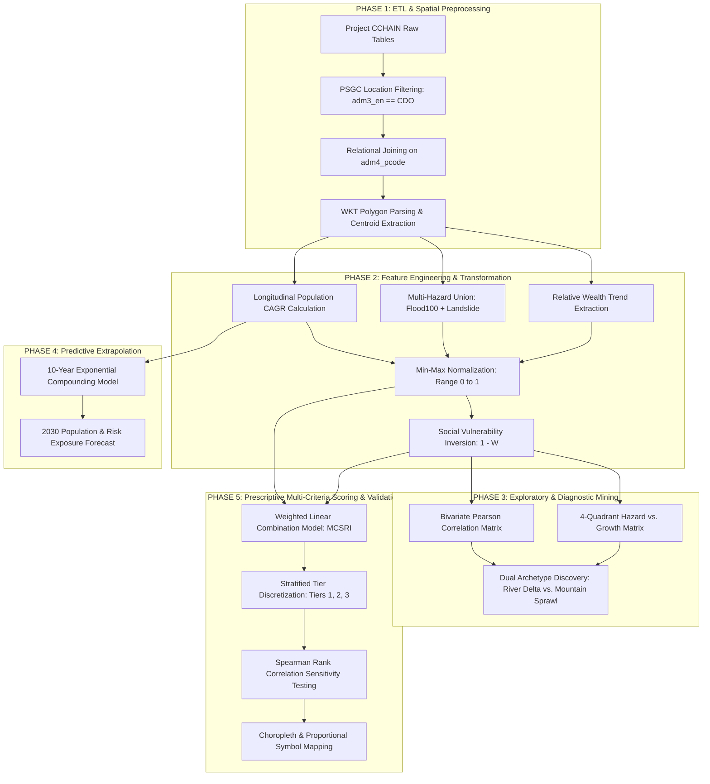

# Comprehensive Data Mining Methodology: From ETL to Prescriptive Risk Engine

**Project Title:** Climate-Driven Urban Sprawl & Hazard Exposure Spatial Analytics Engine  
**Study Scope:** Cagayan de Oro City, Northern Mindanao, Philippines (80 Administrative Barangays | PSGC: `PH104305000`)  
**Primary Data Source:** Project CCHAIN (*Climate Change, Health, and AI Network*), Kaggle Open Dataset  
**Target Course:** Data Mining and Applications (DMA) — Laboratory Activity 1  
**Document Purpose:** End-to-End Technical Reference of Data Mining Concepts, Mathematical Formulations, Algorithms, and Pipeline Architectures  

---

## 1. Executive Summary & Pipeline Architecture

This document details the complete data mining lifecycle employed in the **Cagayan de Oro City Urban Sprawl and Hazard Exposure Risk Engine**. The architecture transitions through four foundational pillars of data mining:

1. **Descriptive Data Mining:** ETL extraction, relational linkage, spatial filtering, and baseline feature extraction.
2. **Diagnostic Data Mining:** Correlation structure mining, 4-quadrant spatial cross-tabulation, and urban-rural risk archetype discovery.
3. **Predictive Data Mining:** Longitudinal demographic trend extrapolation to the 2030 planning horizon.
4. **Prescriptive Data Mining:** Multi-criteria spatial risk index (MCSRI) calculation, stratified priority binning, and sensitivity validation.



---

## 2. Phase 1: ETL & Spatial Data Preprocessing

### 2.1 Multi-Table Ingestion & Relational Architecture
The raw data lake originates from **Project CCHAIN** and is stored across eight heterogeneous CSV files in [`data/cchain_raw/`](../data/cchain_raw/). The pipeline extracts seven active tables linked via the **Philippine Standard Geographic Code (PSGC)** at Level 4 (`adm4_pcode`):

```
+----------------------------------------------------------------------------------------------------+
|                                    PROJECT CCHAIN DATA INGESTION                                   |
+----------------------------------------------------------------------------------------------------+
   |                   |                    |                    |                   |          |
   v                   v                    v                    v                   v          v
[location.csv]  [project_noah.csv]  [open_bldgs.csv]   [worldcover.csv]     [worldpop.csv]  [rwi.csv]
(80 Barangays)  (Flood/Landslide)   (Building Density) (Land Cover %)       (2000-2020 Pop) (2016-2022)
   |                   |                    |                    |                   |          |
   +-------------------+--------------------+--------------------+-------------------+----------+
                                               |
                                               v  Filter: adm3_en == 'Cagayan de Oro City'
                                                  Join Key: adm4_pcode (Inner/Left Relational Join)
                                               |
                                               v
                        +-----------------------------------------------+
                        |        UNIFIED 80-BARANGAY MASTER TABLE       |
                        +-----------------------------------------------+
```

### 2.2 Relational Join Execution
In [`src/pipeline.py`](../src/pipeline.py), the administrative boundary lookup table serves as the primary entity spine joined on the common key $k = \mathtt{adm4\_pcode}$:

$$\mathcal{D}_{\text{master}} = \mathcal{T}_{\text{location}} \bowtie_{k} \mathcal{T}_{\text{hazard}} \bowtie_{k} \mathcal{T}_{\text{buildings}} \bowtie_{k} \mathcal{T}_{\text{landcover}} \bowtie_{k} \mathcal{T}_{\text{wealth}} \bowtie_{k} \mathcal{T}_{\text{population}}$$

### 2.3 Handling Temporal Heterogeneity
A critical preprocessing decision in this pipeline is reconciling **static spatial baselines** with **longitudinal time series**:
* **Static Snapshots (`freq: S`):** `project_noah_hazards` (2015), `google_open_buildings` (2023), and `esa_worldcover` (2021).
* **Dynamic Time Series (`freq: Y`):** `worldpop_population` ($N=21$ annual time-steps: 2000–2020) and `tm_relative_wealth_index` ($N=7$ annual time-steps: 2016–2022).

Rather than synthetically imputing static surfaces across time, the data mining architecture treats demographic velocity ($2000\rightarrow2020$) as the **kinetic driver** expanding into a **fixed physical hazard topography**.

### 2.4 WKT Spatial Boundary & Geometric Parsing
Spatial polygons representing official barangay boundaries are parsed from Well-Known Text (`WKT`) strings in `brgy_geography.csv`:

$$\mathcal{P}_i = \operatorname{WKT}(\text{geometry}_i)$$

$$\mathbf{C}_i = \left( \frac{1}{6A} \sum_{j=0}^{n-1} (x_j + x_{j+1})(x_j y_{j+1} - x_{j+1} y_j), \; \frac{1}{6A} \sum_{j=0}^{n-1} (y_j + y_{j+1})(x_j y_{j+1} - x_{j+1} y_j) \right)$$

Where $\mathbf{C}_i = (\text{lon}_i, \text{lat}_i)$ is the geometric centroid used for proportional symbol overlay mapping.

---

## 3. Phase 2: Feature Engineering & Mathematical Transformation

### 3.1 Longitudinal Demographic Growth Mining (CAGR)
To measure demographic sprawl velocity over the 20-year WorldPop longitudinal trajectory, the **Compound Annual Growth Rate (CAGR)** is computed for each barangay $i$:

$$\text{CAGR}_i = \left( \frac{P_{i, 2020}}{P_{i, 2000}} \right)^{\frac{1}{t_{\text{last}} - t_{\text{first}}}} - 1 = \left( \frac{P_{i, 2020}}{P_{i, 2000}} \right)^{\frac{1}{20}} - 1$$

* **Zero-division Guard:** If $P_{i, 2000} \le 0$, the value is safely coerced to avoid undefined singularities:
  $$\text{CAGR}_i = \operatorname{fillna}\left(\text{CAGR}_i, 0\right)$$

### 3.2 Multi-Hazard Physical Union
Physical hazard exposure represents the joint percentage of barangay territory falling within critical 100-year flood inundation ($>1.5\text{m}$ depth) or severe slope failure zones:

$$\text{HazardExposure}_i = \text{Flood100YrHigh}_i + \text{LandslideHigh}_i$$

$$\text{HazardExposure}_i \in [0, 100]\%$$

### 3.3 Socioeconomic Resilience Trend Mining
Using the Meta/Thinking Machines Relative Wealth Index ($RWI \in [-2, +2]$), both the current baseline and the 6-year socioeconomic trajectory are extracted:

$$\text{RWI}_{\text{latest}, i} = \text{RWI}_{i, 2022}$$

$$\Delta \text{RWI}_i = \text{RWI}_{i, 2022} - \text{RWI}_{i, 2016}$$

### 3.4 Min-Max Feature Normalization
Because the engineered features span fundamentally incompatible units (percentages, counts per hectare, growth rates, economic indices), all indicators are normalized onto a standard dimensionless range $[0, 1]$:

$$\widetilde{X}_{i} = \frac{X_i - \min(\mathbf{X})}{\max(\mathbf{X}) - \min(\mathbf{X})}$$

Where $\mathbf{X}$ is the vector of values across all 80 barangays of Cagayan de Oro City.

### 3.5 Social Vulnerability Inversion
In disaster risk theory, wealth acts as a resilience factor (buffer), whereas lack of wealth represents vulnerability. To align all indicators such that **higher value = higher risk**, the normalized Relative Wealth Index is inverted:

$$\widetilde{V}_i = 1 - \widetilde{W}_i = 1 - \widetilde{\text{RWI}}_{\text{latest}, i}$$

---

## 4. Phase 3: Diagnostic Data Mining & Pattern Discovery

### 4.1 Bivariate Correlation Mining
To understand the underlying structural relationships across CDO's landscape, a Pearson correlation matrix is evaluated across the 80 barangays:

$$r_{X, Y} = \frac{\sum_{i=1}^{n} (X_i - \bar{X})(Y_i - \bar{Y})}{\sqrt{\sum_{i=1}^{n} (X_i - \bar{X})^2 \sum_{i=1}^{n} (Y_i - \bar{Y})^2}}$$

```
========================================================================================
PEARSON CORRELATION MATRIX (CDO 80-BARANGAY MASTER DATASET)
========================================================================================
Variable                           (1)      (2)      (3)      (4)      (5)      (6)
----------------------------------------------------------------------------------------
(1) Hazard Exposure               1.000    0.053    0.013   -0.058    0.918    0.199
(2) Population CAGR (2000-2020)   0.053    1.000    0.015   -0.176   -0.078    0.324
(3) Building Density              0.013    0.015    1.000    0.713    0.236   -0.551
(4) Relative Wealth Index (RWI)  -0.058   -0.176    0.713    1.000    0.239   -0.733
(5) 100-Yr Flood High Area %      0.918   -0.078    0.236    0.239    1.000   -0.206
(6) High Landslide Area %         0.199    0.324   -0.551   -0.733   -0.206    1.000
========================================================================================
```

#### Key Diagnostic Insights Discovered:
1. **Topographic Socioeconomic Segregation ($r = -0.733$):** Wealth strongly decreases as landslide hazard increases. Low-income families occupy steep, unserviced mountain slopes.
2. **Sprawl into Unstable Slopes ($r = +0.324$):** Population CAGR is positively correlated with Landslide Hazard, proving that demographic growth is disproportionately penetrating hazardous upland terrains.
3. **Urban Core Wealth Concentration ($r = +0.713$):** Wealth strongly correlates with Building Density on the coastal plain.

---

### 4.2 Four-Quadrant Spatial Cross-Tabulation
By establishing municipal mean thresholds ($\bar{\mu}_{\text{CAGR}} = 2.86\%$, $\bar{\mu}_{\text{Hazard}} = 21.48\%$), the 80 barangays are partitioned into four diagnostic quadrants in [`figures/hazard_vs_growth.png`](../figures/hazard_vs_growth.png):

```
       Population CAGR (%)
             ^
             |    QUADRANT II: Upland Sprawl Outliers    |    QUADRANT I: High Hazard x High Growth
             |    - Tignapoloan (4.27% CAGR, 43% Haz)   |    - Iponan (3.17% CAGR, 53% Haz)
             |    - Besigan (4.07% CAGR, 41% Haz)       |    - Agusan (3.41% CAGR, 36% Haz)
     2.86% --+------------------------------------------+----------------------------------------
      (Mean) |    QUADRANT III: Stable Safe Plateaus    |    QUADRANT IV: Urban Core Flood Trap
             |    - Central agricultural belt           |    - Brgy 17 (95.1% Flood, 2.92% CAGR)
             |    - Low hazard, moderate growth         |    - Consolacion (92.9% Flood, 2.77% CAGR)
             |                                          |    - Brgy 15, 13, 18, 10
             +------------------------------------------+---------------------------------------->
             0%                                       21.48% (Mean)                       100%
                                            Hazard Exposure (% Area)
```

---

### 4.3 Identification of Dual Risk Archetypes

```
+----------------------------------------------------------------------------------------------------+
|                                    TWO POLAR RISK ARCHETYPES IN CDO                                |
+----------------------------------------------------+-----------------------------------------------+
| ARCHETYPE 1: URBAN RIVERINE DELTA TRAP             | ARCHETYPE 2: UPLAND STEEP-SLOPE SPRAWL        |
+----------------------------------------------------+-----------------------------------------------+
| • Geographic Setting: Coastal / River Mouth        | • Geographic Setting: Southern Hinterlands    |
| • Primary Hazard: 100-Yr Flood Inundation (>1.5m)  | • Primary Hazard: Rain-Induced Landslides     |
| • Building Density: Extreme (>30 to 64 bldgs/ha)   | • Building Density: Very Low (<1.0 bldgs/ha)  |
| • Wealth Index: Moderate-High (RWI > 0.70)         | • Wealth Index: Acute Poverty (RWI ~0.27-0.32)|
| • Growth Rate: Moderate Steady (2.6% - 2.9% CAGR)  | • Growth Rate: Explosive (4.0% - 4.27% CAGR)  |
| • Key Barangays: Brgy 17, Consolacion, Brgy 15, 13 | • Key Barangays: Tignapoloan, Besigan, Balubal|
+----------------------------------------------------+-----------------------------------------------+
```

---

## 5. Phase 4: Predictive Demographic Extrapolation

To forecast emerging demographic exposure under a "business-as-usual" trajectory, a 10-year compounding horizon ($2020 \rightarrow 2030$) is computed for each barangay:

$$P_{i, 2030} = P_{i, 2020} \times (1 + \text{CAGR}_i)^{10}$$

$$\Delta P_{i, \text{net}} = P_{i, 2030} - P_{i, 2020}$$

$$\text{ProjectedGrowthPct}_i = \left( \frac{P_{i, 2030} - P_{i, 2020}}{P_{i, 2020}} \right) \times 100\%$$

### City-Wide Demographic Forecast:
* **2000 Baseline:** 419,805 residents
* **2020 Baseline:** 752,065 residents ($+79.15\%$ net expansion over 20 years)
* **2030 Forecast:** **1,008,397 residents** (surpassing the 1-million metropolitan threshold)
* **High-Priority Exposure (Tiers 2 & 3):** Expands from **317,160 residents (2020)** to **434,279 residents (2030)** living inside hazard-prone jurisdictions.

---

## 6. Phase 5: Prescriptive Multi-Criteria Scoring & Ranking

### 6.1 Multi-Criteria Spatial Risk Index (MCSRI) Formula
To synthesize heterogeneous variables into a single, transparent municipal priority score $R_i \in [0, 1]$, an **Additive Linear Combination (ALC)** model is executed in [`src/pipeline.py`](../src/pipeline.py):

$$R_i = w_h \cdot \widetilde{H}_i + w_g \cdot \widetilde{G}_i + w_d \cdot \widetilde{D}_i + w_w \cdot (1 - \widetilde{W}_i)$$

Where:
* $\widetilde{H}_i$: Normalized Composite Hazard Exposure ($\text{weight } w_h = 0.40$)
* $\widetilde{G}_i$: Normalized Population Growth Rate $\text{CAGR}_i$ ($\text{weight } w_g = 0.30$)
* $\widetilde{D}_i$: Normalized Google Building Density ($\text{weight } w_d = 0.15$)
* $1 - \widetilde{W}_i$: Normalized Inverse Relative Wealth Index ($\text{weight } w_w = 0.15$)

$$\sum w = 0.40 + 0.30 + 0.15 + 0.15 = 1.00$$

---

### 6.2 Stratified Priority Discretization (Tiers)
The continuous score $R_i$ is mapped into three discrete, actionable municipal intervention tiers:

```
[ 0.00 ----------------------- 0.33 ----------------------- 0.60 ----------------------- 1.00 ]
      TIER 1: MONITOR               TIER 2: PRIORITY MITIGATION        TIER 3: CRITICAL INTERVENTION
       44 Barangays                         33 Barangays                        3 Barangays
     (434.9k population)                  (291.0k population)                 (26.2k population)
```

| Tier Name | Score Range | Barangay Count | 2020 Population | Mandated Local Government Action |
|---|---|---|---|---|
| **Tier 1: Monitor** | $R_i < 0.33$ | 44 | 434,904 (57.8%) | Baseline hydrometeorological surveillance; conservation zoning; agricultural greenbelt protection. |
| **Tier 2: Priority Mitigation** | $0.33 \le R_i < 0.60$ | 33 | 290,988 (38.7%) | Slope stabilization (riprap/vetiver grass); drainage desiltation; conditional geohazard building clearances. |
| **Tier 3: Critical Intervention** | $R_i \ge 0.60$ | 3 | 26,172 (3.5%) | Immediate building moratorium on floodways/slopes; relocation feasibility studies; structural retention dikes. |

---

### 6.3 Top 15 Ranked Barangays in Cagayan de Oro

```
+--------------------------------------------------------------------------------------------------------------------------------------+
| RANK | BARANGAY (`adm4_en`)     | SCORE | TIER   | HAZARD % | 100-YR FLOOD | LANDSLIDE | CAGR % | 2020 POP | 2030 PROJ | RWI   | BLD/HA |
+------+--------------------------+-------+--------+----------+--------------+-----------+--------+----------+-----------+-------+--------+
| 1    | Barangay 17 (Pob.)       | 0.640 | Tier 3 | 95.14%   | 95.14%       | 0.00%     | 2.92%  | 3,720    | 4,962     | 0.769 | 37.88  |
| 2    | Consolacion              | 0.625 | Tier 3 | 92.90%   | 92.90%       | 0.00%     | 2.77%  | 10,333   | 13,581    | 0.733 | 36.97  |
| 3    | Tignapoloan              | 0.613 | Tier 3 | 43.05%   | 5.04%        | 38.01%    | 4.27%  | 12,119   | 18,410    | 0.318 | 0.33   |
| 4    | Barangay 15 (Pob.)       | 0.595 | Tier 2 | 90.42%   | 90.42%       | 0.00%     | 2.68%  | 5,691    | 7,413     | 0.761 | 35.83  |
| 5    | Barangay 13 (Pob.)       | 0.590 | Tier 2 | 82.65%   | 82.65%       | 0.00%     | 3.07%  | 2,487    | 3,366     | 0.761 | 30.08  |
| 6    | Besigan                  | 0.589 | Tier 2 | 40.61%   | 5.93%        | 34.68%    | 4.07%  | 1,091    | 1,626     | 0.302 | 0.22   |
| 7    | Barangay 18 (Pob.)       | 0.582 | Tier 2 | 70.87%   | 70.87%       | 0.00%     | 2.89%  | 2,250    | 2,992     | 0.769 | 64.12  |
| 8    | Barangay 10 (Pob.)       | 0.505 | Tier 2 | 68.50%   | 68.50%       | 0.00%     | 2.77%  | 542      | 712       | 0.744 | 29.20  |
| 9    | Iponan                   | 0.488 | Tier 2 | 52.97%   | 52.97%       | 0.00%     | 3.17%  | 30,458   | 41,608    | 0.661 | 21.72  |
| 10   | Barangay 26 (Pob.)       | 0.464 | Tier 2 | 58.16%   | 58.16%       | 0.00%     | 2.63%  | 2,420    | 3,136     | 0.738 | 37.44  |
| 11   | Balubal                  | 0.460 | Tier 2 | 43.18%   | 6.65%        | 36.53%    | 3.08%  | 2,609    | 3,534     | 0.466 | 1.63   |
| 12   | Agusan                   | 0.458 | Tier 2 | 36.34%   | 12.16%       | 24.18%    | 3.41%  | 14,856   | 20,774    | 0.525 | 9.13   |
| 13   | Barangay 7 (Pob.)        | 0.456 | Tier 2 | 58.21%   | 58.21%       | 0.00%     | 2.80%  | 444      | 584       | 0.744 | 24.54  |
| 14   | Dansolihon               | 0.451 | Tier 2 | 32.75%   | 5.92%        | 26.84%    | 3.04%  | 8,392    | 11,328    | 0.328 | 0.73   |
| 15   | Tumpagon                 | 0.447 | Tier 2 | 41.30%   | 5.28%        | 36.02%    | 2.46%  | 1,416    | 1,806     | 0.272 | 0.28   |
+------+--------------------------+-------+--------+----------+--------------+-----------+--------+----------+-----------+-------+--------+
```

---

## 7. Phase 6: Sensitivity Testing & Model Robustness

### 7.1 Multi-Weight Sensitivity Evaluation
To verify that the resulting ranking is not an arbitrary artifact of the linear weights ($w = [0.40, 0.30, 0.15, 0.15]$), three alternative weighting paradigms were evaluated:

1. **Equal Weight Benchmark ($S_{\text{equal}}$):** $[0.25, 0.25, 0.25, 0.25]$
2. **Hazard-Dominant Safety Model ($S_{\text{haz}}$):** $[0.60, 0.20, 0.10, 0.10]$
3. **Growth-Dominant Sprawl Model ($S_{\text{gro}}$):** $[0.20, 0.50, 0.15, 0.15]$

### 7.2 Spearman Rank Correlation ($\rho$)
Rank correlation across all 80 barangays was calculated via:

$$\rho = 1 - \frac{6 \sum d_i^2}{n(n^2 - 1)}$$

Where $d_i = \text{Rank}_A(i) - \text{Rank}_B(i)$ and $n = 80$.

$$\rho(S_{\text{current}}, S_{\text{equal}}) = \mathbf{0.962} \quad (p < 0.001)$$

$$\rho(S_{\text{current}}, S_{\text{haz}}) = \mathbf{0.973} \quad (p < 0.001)$$

$$\rho(S_{\text{current}}, S_{\text{gro}}) = \mathbf{0.897} \quad (p < 0.001)$$

**Conclusion:** All coefficients exceed $\rho \ge 0.897$, proving that the prioritization hierarchy is statistically robust and resilient against weighting variations.

---

## 8. Phase 7: Spatial Visual Data Mining (Cartography)

The figure generation script [`src/figures.py`](../src/figures.py) produces four visual data mining deliverables:

```
+----------------------------------------------------------------------------------------------------+
| FIGURE ARTIFACT            | MINING VISUALIZATION TECHNIQUE            | FILE LOCATION             |
+----------------------------+-------------------------------------------+---------------------------+
| 1. Barangay Risk Map       | Administrative Choropleth Boundary Fill   | figures/cdo_risk_map.png  |
| 2. Sprawl Points Map       | Choropleth + Proportional Centroid Bubbles| figures/cdo_sprawl_points_map.png |
| 3. Diagnostic Scatter Plot | Four-Quadrant Bivariate Cross-Tabulation  | figures/hazard_vs_growth.png |
| 4. Priority Bar Chart      | Ranked Horizontal Threshold Transition    | figures/top_risk_barangays.png |
+----------------------------------------------------------------------------------------------------+
```

### Proportional Symbol Formula for Sprawl Bubbles
To visually highlight extreme demographic sprawl velocity in [`figures/cdo_sprawl_points_map.png`](../figures/cdo_sprawl_points_map.png), marker sizes are scaled using a non-linear power function:

$$\text{BubbleSize}_i = (100 \times \text{CAGR}_i)^{2.2} \times 12$$

This non-linear scaling visually separates standard growth ($2.5\%\text{ CAGR}$) from explosive mountain sprawl ($>4.0\%\text{ CAGR}$ in Tignapoloan and Besigan).

---

## 9. Summary of Key Data Mining Techniques Used

| Pipeline Stage | Classical Data Mining Technique | Specific Mathematical/Algorithmic Execution |
|---|---|---|
| **ETL & Ingestion** | Entity Resolution & Spatial Joining | Relational join of 7 tables on PSGC key `adm4_pcode`; spatial filtering on `adm3_en`. |
| **Preprocessing** | Geometric Parsing & Centroid Extraction | Shapely WKT polygon decoding; polygon centroid coordinate computation. |
| **Feature Engineering** | Longitudinal Trend Extraction | Compound Annual Growth Rate (CAGR) formulation over 20-year demographic raster time series. |
| **Data Transformation** | Min-Max Normalization & Inversion | Feature scaling to $[0, 1]$; social vulnerability inversion ($1 - \widetilde{W}$). |
| **Exploratory Mining** | Bivariate Correlation Profiling | Pearson correlation matrix evaluation across demographic, physical, and economic dimensions. |
| **Pattern Discovery** | Four-Quadrant Spatial Discretization | Cross-tabulation against empirical mean thresholds ($\bar{\mu}_{\text{CAGR}}$, $\bar{\mu}_{\text{Hazard}}$). |
| **Predictive Modeling** | Exponential Trend Extrapolation | Compound geometric demographic forecasting forward to the 2030 planning horizon. |
| **Prescriptive Modeling**| Multi-Criteria Linear Combination | Multi-Criteria Spatial Risk Index ($0.40H + 0.30G + 0.15D + 0.15(1-W)$). |
| **Stratification** | Discretization / Binning | Equal-interval / heuristic threshold binning into Tiers 1, 2, and 3. |
| **Evaluation** | Non-Parametric Rank Sensitivity Testing | Spearman rank correlation ($\rho$) across 4 distinct weighting paradigms. |
| **Visual Mining** | Thematic Cartography & Proportional Symbols | Polygon Patch Collections & exponential bubble overlays with spatial callouts. |
